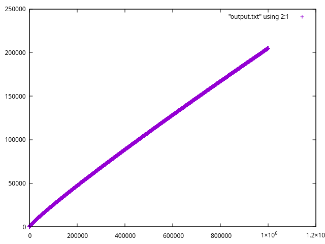

# yee

Let us do our medieval mathematician friends a favor by finding out what the
number 𝑒 is. Here, I'll be using C like what real computer programmers do.
Python will also be used as a complementary tool since it has a builtin
`decimal` module that can help us do some really high decimal precision
calculations.


> This is part of a bonus homework from the single variable calculus class I
> took here in my local college. I need to submit my code so I uploaded them
> here. In this homework, we were asked to write programs to find what number 𝑒
> is using the following 3 methods.

## Method A - Definition of 𝑒 as the Natural Logarithm Base

The number 𝑒 is the number in the domain of the natural logarithm that
satisfies:

$$ \ln(e) = \int\_{1}^{e} \mathrm{d}t = 1 $$

### Intuition

We know that Riemann Sum can help us programatically find out area under a
curve. Here, I'll be using a similar method to Riemann Sum to find out what 𝑒
is: only set the left bound and start doing mid-point sum with `delta x` until
the accumulated area exceeds 1. When that happens, the right bound will be what
we're looking for.

It's important to point out that when calculating slices of areas in Riemann
Sum, two numbers are multiplied together, causing the precision to be doubled.
Since C's `double` data type only has 15 decimal digits of precision, `delta x`
can only has up to 7 decimal digits of precision. Anything more than that will
cause underflow (assuming f(x) also has 7 decimal digits of precision).

Therefore, when we set `delta x` to be `10e-7`, we'll get an estimation of 𝑒
that has a precision of 7 decimal digits. Which, to be fair, is good enough
considering C's `float` data type only has 7 decimal digits of precision.

### Implementation

This is how I implemented method a.

```c
double area = 0.f;
double x = 1.f;
double delta_x = 10e-7;

for (; area < 1.f; x += delta_x) {
    double next_x = x + delta_x;
    double midpoint = (1.f / x + 1.f / next_x) / 2.f;
    area += midpoint * delta_x;
}

float e = x;
```

It would be nice to further optimize the code, but the approximation is already
close enough (7 decimal digits to be exact), so I decided to leave it like that.

### Performace

It takes us 10 million iterations just to get an estimation of 𝑒 with 7 decimal
digits of precision. We can further generalize this precision-iteration ratio:
to compute 𝑒 with `n` decimal digits of precision, we need to iterate 10 to the
power of `n` times.

## Method B - Definition of 𝑒 as a Limit

$$
𝑒 = \lim\limits_{\delta \to 0} (1 + \delta)^{\frac{1}{\delta}} =
\lim\limits_{n \to \infty} \left(1 + \frac{1}{n}\right)^{n}
$$

### A non-iterative method

If we were to estimate 𝑒 with this method, the code won't be iterative. To
further explain, for method b we'll need to set a small enough delta for the
formula on the left or a large enough n for formula on the right. Either way, we
then only need to take the base to some power `N`.

### An interesting relation between n and precision

With a little bit of help from python's builtin `decimal` module, I found that
if we use the formula on the right, we'll get an interesting relation between
`N` and number 𝑒's decimal precision: when `N` is 10 to the power of `n`, the
estimated 𝑒 will (most of the time) have a decimal precision of `n`.

See for yourself by running `yee.py` with the following argument:

```bash
python yee.py b
```

First 15 rows of output:

```bash
10^n    correct decimal digits
1       1
2       2
3       3
4       4
5       5
6       6
7       7
8       8
9       9
10      10
11      11
12      11 <- oops
13      13
14      14
15      15
```

### Implementation

It takes us only 2 lines of code to implement the formula on the right in C.
Note that our n is `10e7`, so the 𝑒 estimated will have a decimal precision of 7
digits.

```c
double n = 10e7;
float e = pow(1.f + 1.f / n, n);
```

Surprisingly, the function `pow()` introduces small errors when n is larger than
10e6. So, in theory, the program above should give us 2.7182818, but it actually
gives 2.7182817 instead.

### Performace

Since it's a constant function, method b's performace is great.

## Method C - Definition of 𝑒 as a Series

$$ 𝑒 = \sum\_{{n=0}}^{\infty} \frac{1}{n!} $$

### Intuition

Since in this definition, 𝑒 is defined by summing up things, we can easily
convert this into a loop. We terminate the iteration when the difference between
the accumulated 𝑒 from current step and the accumulated 𝑒 from the previous step
is less than our target precision.

### Implementation

```c
size_t ITERATION_CAP = 1000;
double EPSILON = 10e-7;

double e = 0.f;
double prev_e = 0.f;
double one_over_factorial = 1.f;

for (size_t i = 1; i < ITERATION_CAP; i++) {
    prev_e = e;
    e += one_over_factorial;
    one_over_factorial *= 1.f / (double)i;
    if (fabs(e - prev_e) < EPSILON) {
        break;
    }
}
```

### Performace

It only takes 11 iterations to get to our desired decimal precision (as usual, 7
since that's what C's `float` data type supports). I doubled the precision and
this time, it takes 18 iterations. It's really performant even for higher
precisions! I wonder if we can go even further with method c...

### Infinitely precise representation of e

With python's builtin `decimal` module, I wrote a script and found that the
precision of our approximation of e grows steadily with each iteration. In fact,
it's even possible to get a precision of 1 million decimal digits with 200k
iterations. The graph below help illustrate the relation between the number of
iteration(x axis) and number of decimalprecision (y axis):



The graph above is generated by plotting `method_c.1mil.txt` with gnuplot. You
can generate your own by running `yee.py` with the following argument:

```bash
python yee.py c
```

or

```bash
python yee.py c_optimized
```

## Conclusion

For our medieval mathematician friends who do calculations by hand, method c is
the only feasible way since it will only take them a few mathematical operations
to get a good enough estimation of the number e. And the precision can be
further increased by adding more terms to the calculated e in the future.

For us, if we only need a rough approximation (for example, 7 decimal digits of
precision like what C's `float` data type supports), both method b and method c
can get the job done under little to no time. Considering method b only takes 2
lines to implement, I'll definitely reccommend that to our medieval
mathematician friends!

If we, for some reason, need a precision higher than 7 decimal digits, method b
is out of town because of the error `pow()` introduces (assuming we're using C
like a real computer programmer). Method c is perfect here since it's still very
performant and can get us however many decimal digits of precision we want.

In `yee.c`, there's a function for benchmarking. Below is output of the
benchmarking result for estimating e (7 decimal precision) 10,000 times. It
showed us that method b and c are equally performant.

```
Benchmarking result for estimating e 10000 times:
Method  Time Taken(sec)
a       43.185198
b       0.000119
c       0.000218
```

That's about it! Hope our medieval mathematician friends can learn something
from this random github repo. It took me a long time writing all this shites.

## Quick Start

```bash
$ ./build.sh
$ ./yee -m a
$ ./yee -b abc 10000
```

or

```bash
$ cmake -S . -B build
$ cmake --build build
$ ./build/yee -m a
$ ./build/yee -b abc 10000
```
